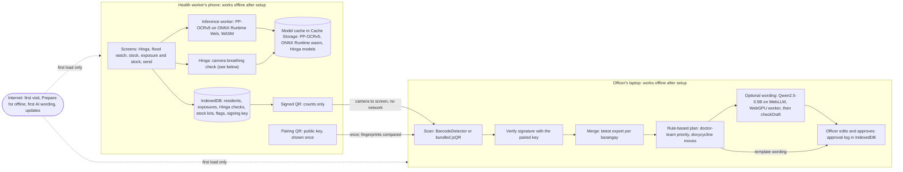

# Architecture

Agapay is one offline-first web app (a PWA: Vite, React, TypeScript, `vite-plugin-pwa`) served as static files from Vercel. The barangay health worker uses the phone screens; the municipal health officer uses the laptop screens of the same app. There is no server and no cloud AI: every model runs in the browser, and the only link between the phone and the laptop is a QR code shown on one screen and scanned by the other.

Sizes, hashes, sources and licenses of every file are in the [README](../README.md) (Models used, What requires internet). This document links to them rather than repeating them.

## Overview

## Offline: what loads when

| When | What | Where it's kept |
|---|---|---|
| First visit (online) | The app shell: HTML, JS, CSS (size: README, What requires internet) | Service worker precache (Workbox) |
| "Prepare for offline" (one tap, online) | The phone's models and runtime `.wasm` (files and exact byte counts: README) | Model cache: one Cache Storage cache per model id and version |
| First AI wording on the laptop (optional, online) | The model weights and WebGPU library, fetched by WebLLM; the app's worker for it | WebLLM's own cache; the worker via a cache-first service worker rule |
| Every later visit | Nothing: everything above loads from the device | |
| App updates (online) | The new app shell | Precache, replaced on the next load |

- **The precache is the app shell only** (`vite.config.ts`). Models are not precached, so the first visit stays light for every visitor and the large download is a deliberate, designed step.
- **Prepare for offline** (`src/lib/modelDownload.ts`, `useModelDownload.ts`, screen `/prepare`) first asks for persistent storage (`navigator.storage.persist()`; it waits at most 3 s for a browser prompt) and checks the free space against the download plus 10% headroom. It then streams each file into the model cache (`src/lib/modelCache.ts`) and stores a file only if its byte count matches the expected size. A retry resumes from the last whole file, and old versions can be evicted. Features register their models in a `models.ts` next to their code.
- **Runtimes read model bytes straight from Cache Storage** (`loadModelFile`), including inside workers, and hand them to the runtime: ONNX Runtime gets its `.wasm` as `wasmBinary`. Offline inference therefore doesn't depend on the service worker seeing requests made from a worker. The service worker also serves `/models/` and `.wasm` requests from the model caches, for anything else that fetches them.
- **Updates**: the service worker auto-updates. While a model download runs, the page holds off the reload a new deploy would trigger (`appShell.holdReload()`).
- **Reset sample data** (`/device`): puts every record back to the synthetic seed dated today and keeps the model cache, the service worker and the device key. It's for rehearsals and Demo Day, so nothing is re-downloaded on venue Wi-Fi.
- **Checked by tests**: CI e2e tests load the built app, go offline, reload and open a deep link; prepare the models, go offline, reload and load a model file and the runtime `.wasm` from the cache; run the phone's wow flow; and reset the sample data while a model cache survives. The live URL passed the offline smoke test (`docs/OFFLINE-SMOKE-TEST.md`).

## On-device AI pipelines

### Medicine-box OCR (phone)

- **Models**: PP-OCRv5 mobile text detection and English text recognition, ONNX exports, self-hosted unmodified with their dictionary (sources, sizes, SHA-256 and licenses: README).
- **Runtime**: `onnxruntime-web`, its plain WebAssembly build (no WebGPU or JSEP code), single-threaded, in a module Web Worker (`src/inference/inference.worker.ts`, `src/inference/ocr/`). The main thread only decodes the photo and shows results.
- **Pipeline**, following the models' own `inference.yml` (PaddlePaddle on Hugging Face):
  1. The photo is decoded with its EXIF orientation and drawn at most 1280 px on its long side (`imageToPixels`).
  2. Detection input: long side 960 px, each side a multiple of 32, BGR channels, ImageNet mean and standard deviation.
  3. DB post-processing: probability threshold 0.3, box score at least 0.6, unclip ratio 1.5, axis-aligned boxes, reading order top to bottom.
  4. Each box is cropped (tall crops are turned 90°). Recognition input: height 48, at least 320 wide, scaled to [-1, 1].
  5. CTC greedy decoding with the 436-character dictionary. Lines scoring under 0.5 are dropped.

  The post-processing and decoding are our own TypeScript implementations of PaddleOCR's published algorithms (disclosed in the README).
- **Label reading is rules, not AI** (`src/rules/label.ts`): drug (matched against a short list of generic names, allowing a few misreads), strength, lot (`LOT`, `Lot No`, `Batch`, `B.No`) and expiry (`EXP`, `Exp. Date`, `Expiry`; MM/YYYY, MM/YY, YYYY-MM, MMM YYYY, DD/MM/YYYY). Each field gets a confidence, the OCR line's score times how sure the match is. A manufacturing date is never taken as the expiry.
- **Validation**: the worker checks the input pixels' shape, and decoding refuses a model whose class count doesn't match the dictionary. The review screen marks any field under 0.8 confidence as "check this". The health worker corrects the fields, types the quantity and confirms; nothing is saved without that. The photo is never stored.
- **Tests**: unit tests on synthetic probability maps and fakes, and CI-only tests that run the real models on a synthetic rendered label and on the demo box's label.
- **Fallback**: Tesseract.js (`src/inference/tesseract/`) behind one switch, `TESSERACT_ON_IPHONE` in `src/inference/ocr/engine.ts`, which is off. When on, only iPhones use it, with its files read from the model cache as blob URLs and bytes. `?engine=tesseract|ppocr|auto` overrides the engine in one browser, to compare them on a real phone. The fallback has not yet run in a browser.

### Plan wording (laptop, optional)

- **Model**: Qwen2.5-0.5B-Instruct, WebLLM's 4-bit build `q4f16_1`, or `q4f32_1` when the GPU lacks `shader-f16` (`src/features/municipal/llm/model.ts`). License and download size: README.
- **Runtime**: WebLLM in its own Web Worker (`webllm.worker.ts`) behind the app's inference protocol, on WebGPU only. The main thread never loads the library.
- **Input**: the rule-based plan's template text (`planTemplateText` in `src/rules/plan.ts`). The rules already decided every number, priority and stock move; the model only rewords them. The prompt forbids adding numbers, doses, diagnoses or actions.
- **Bounds**: at most 250 tokens, temperature 0.2, a 90 s timeout, and a Stop button.
- **Output check** (`checkDraft`, pure and unit-tested): the draft is offered only if:
  - every number in it, digits or number words, appears in the template;
  - it uses no dose, mg, tablet, per-person, schedule, "take", diagnosis or prescription wording beyond the template's own reminder;
  - it names no barangay outside the plan;
  - it keeps every priority barangay, in order.

  Otherwise the officer keeps the template wording and sees the reasons.
- **Fallback**: without a usable WebGPU (none, or a software adapter) the panel says the AI is unavailable and the template is used. The officer edits and approves either way, and the approval log records whether the wording came from the model or the template.

### Hinga (camera breathing check, phone)

- **What it is**: a screening aid that counts a calm child's breaths per minute from the phone's rear camera and compares the count with the WHO IMCI 2014 fast-breathing cut-off for the child's age. The result is "Fast breathing for age: refer", "Not fast breathing for age", or "No count" with the reason. It never diagnoses.
- **Models**: MediaPipe Pose Landmarker lite, to find the torso, and YAMNet, to hear crying, on MediaPipe Tasks Vision and Audio 1.0.1 (sizes, sources and licenses: README).
- **Runtime**:
  - The pose model runs in a module Web Worker (`src/inference/hinga/`) on the CPU through WebAssembly; no GPU delegate, for iPhone safety. The main thread sends one video frame at a time as a transferred `ImageBitmap`, with one frame in flight.
  - If the worker can't start, the tracker falls back to the main thread and the screen says which one runs and why (`POSE_IN_WORKER`).
  - YAMNet runs in its own worker. The microphone is open only during the count, and its audio is classified in pieces of about 1 s and then dropped; it's never stored or sent.
  - Both runtimes and models are read from the model cache.
- **Counting** (`COUNT_METHOD = 'pose-torso'` in `src/inference/hinga/method.ts`; constants in `dsp.ts`):
  1. The shoulders (landmarks 11 and 12, both required) and the hips (23 and 24, which may be out of frame) give the torso box, locked when the count starts.
  2. Each frame gives two signals: the mean brightness inside the torso box and the height of the shoulder midpoint.
  3. Both are resampled to 10 Hz, detrended and band-passed from 0.2 to 1.7 Hz (12 to 102 breaths per minute).
  4. The rate is the spectral peak over sliding 30 s windows (5 s hop), checked against a zero-crossing count over the whole minute. A count is reported only if the two agree within 3/min, the windows agree within 6/min and the peak is clear (prominence at least 0.6). The signal with the clearer peak is used.
  5. The count is compared with the cut-off for the age band (`src/rules/imci.ts`): 60/min or more under 2 months, 50 or more from 2 up to 12 months, 40 or more from 12 months up to 5 years (exactly 12 months uses 40).
- **Refusals instead of guesses**:
  - the recording is shorter than 50 s, below 5 frames per second or has a gap over 1 s
  - the torso is lost in more than 20% of frames
  - the torso box moves or changes size beyond its limits in more than 10% of frames
  - there's no clear rhythm, or the counts disagree
  - crying: either YAMNet crying class scores above 0.3 for more than 3 s of the minute
  
  If the microphone isn't allowed, the count still runs and the screen says "Cry check off".
- **Danger signs**: the four WHO IMCI 2014 general danger signs (not able to drink or breastfeed, vomits everything, convulsions, lethargic or unconscious), plus chest indrawing and stridor in a calm child. Any tick makes the result an urgent referral, whatever the count. That's more cautious than IMCI 2014 for chest indrawing and stridor, on purpose, for a refer-only screening aid.
- **Tests**:
  - Synthetic breathing signals at 20, 30, 45 and 60/min with noise and drift come back within 2/min.
  - White noise and random-walk noise refuse, and a motion step trips the gate.
  - The IMCI bands are covered, including the 12-month edge; "vomits everything" alone is urgent.
  - The real-phone trials are recorded in `docs/SPIKE-HINGA.md`.
- **Settings are first settings**: every threshold above was set against synthetic signals, and changes only from measured phone trials. We claim no accuracy figure.

## Data and privacy

| Device | Stores (IndexedDB) |
|---|---|
| Phone | residents (synthetic), flood events, exposures, Hinga checks, stock lots, clinician-review flags, the device's signing identity |
| Laptop | paired devices (barangay → public key), received QR payloads, plans, approvals |

- **Never leaves the phone**: names, birth dates, households and puroks, exact dates, photos of medicine boxes, camera frames and microphone audio.
- **What does leave, by QR** (`src/qr/`, payload v1):
  - Contents: the municipality and barangay codes, the ISO week (never a date), the export number, and counts only:
    - exposed residents by six age bands;
    - residents in the watch window now;
    - fast-breathing referrals by the three IMCI age bands;
    - urgent referrals;
    - doxycycline capsules on hand and expiring within 6 weeks;
    - open clinician-review flags.
  - Counts from 1 to 4 are sent as `"<5"` (0 stays 0), so no one can be picked out, and the payload carries no totals.
  - The validator rejects unknown keys and any free text, and the decoder accepts only the exact bytes the encoder writes.
  - Each QR is signed with ECDSA P-256 (SHA-256) by a non-extractable key kept in the phone's IndexedDB.
  - Every export takes the next export number in one transaction. The laptop keeps the newest export per barangay.
  - Size: a realistic payload is 282 bytes and the largest valid one 343 (measured in `src/qr/codec.test.ts`).
- **Pairing**: once, the phone shows a pairing QR with its public key and codes. It isn't signed, so the officer compares the key fingerprint shown on both screens before the laptop trusts it. The laptop rejects a counts QR from a key it hasn't paired.
- **Sample data**: everything in the demo is synthetic ("San Isidro Demo", residents "Residente 001…", lots "DEMO-LOT-…") and labeled as sample data in the app.

## Key decisions

- **A PWA, not a native app**: one codebase for the phone and the laptop, nothing to install from a store, and offline through a service worker. The cost is the browser's limits on iPhone (memory, no share target).
- **WebAssembly, single-threaded, for OCR on every device**: ONNX Runtime's WebGPU path is reported to run away on memory on iOS Safari and is listed as unsupported there. WASM threads would need cross-origin isolation headers. One CPU path behaves the same everywhere.
- **Models on demand, not precached**: the first visit stays small for every visitor (including judges on mobile data), and the big download happens once, on purpose, with progress, a storage check and persistent storage.
- **Rules decide, AI reads and rewords**: counts, the watch window, flags, priorities and stock moves are deterministic, explainable rules with unit tests. The OCR reads labels for a human to confirm. The language model only rewords, and its output is checked against the rules' numbers.
- **Open-source models only**: Qwen2.5-0.5B-Instruct (Apache-2.0) rather than Llama 3.2 1B, whose community license is not an open-source license.
- **No cloud in the core**: no backend, no accounts, no API keys. Static hosting delivers the app; the phone-to-laptop handoff is a QR, not a sync.

## Limitations

- **OCR**: boxes are straight rectangles, so curved bottles, tilted boxes, glare and very small print read worse. The recognizer is English-only. Speed on our phones is measured in the S2 test (TASKS.md), not assumed. The Tesseract fallback hasn't run in a browser.
- **iPhone**: Safari keeps a whole file in memory while caching it, and iOS can close a tab that uses too much memory without an error. Photos are downscaled to 1280 px and the models are small, but this is only proven on our test phones.
- **Laptop AI wording**: it needs WebGPU (desktop Chrome or Edge) and a large first download. A 0.5B model writes plainly at best. `checkDraft` is a word-level check and can't catch every rewording that changes the meaning, so the officer's review is the final safeguard.
- **Storage**: if the browser refuses persistent storage, it may clear the models under storage pressure. The Prepare for offline screen then offers the download again.
- **Pairing**: trust rests on the officer comparing fingerprints. A lost phone's key stays trusted until the laptop pairs a new one ("Reset sample data and pairing" forgets keys on a device).
- **Hinga**: the pose model's own card says it isn't intended for life-critical decisions, and it isn't tested on children; we test only on ourselves, breathing to a metronome. The head and both shoulders must be in view. Camera breath counts are least reliable with movement, crying and young infants, which is why it refuses rather than guesses. All thresholds are untuned until the phone trials.
- **Data and clinical use**: synthetic data only, never real patients. Agapay is a research prototype and screening aid, not a registered medical device: it never diagnoses or doses, and its output is "refer". The watch window and medical sources are cited in the README (Medical sources).
