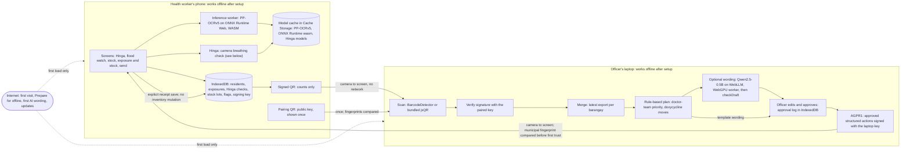
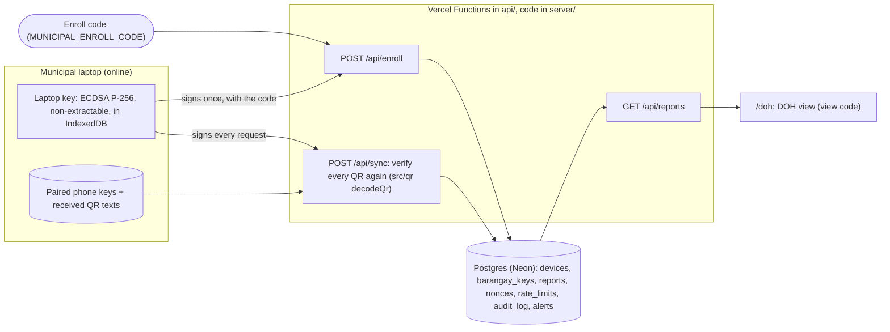

# Architecture

AgapayMo is one offline-first web app (a PWA: Vite, React, TypeScript, `vite-plugin-pwa`) served as static files from Vercel. The barangay health worker uses the phone screens; the municipal health officer uses the laptop screens of the same app. The core has no server and no cloud AI: every model runs in the browser, and the only link between the phone and the laptop is a QR code shown on one screen and scanned by the other. An optional phase 2, built only with `VITE_PHASE2=1`, adds a small sync backend for when the internet returns (see "Phase 2: sync when the internet returns"); the offline core never calls it.

Sizes, hashes, sources and licenses of every file are in the [README](../README.md) (Models used, What requires internet). This document links to them rather than repeating them.

## Overview

## Offline: what loads when

The signed return QR adds a second direction to the same offline link. Phone
trust and the latest instructions persist in the existing `meta` store, with
no database version bump. The laptop reuses its signing identity independently
of cloud enrollment. Protocol, trust, reset behavior and limits are documented
in [Offline return](OFFLINE-RETURN.md).

| When | What | Where it's kept |
|---|---|---|
| First visit (online) | The app shell: HTML, JS, CSS (size: README, What requires internet) | Service worker precache (Workbox) |
| "Prepare for offline" (one tap, online) | The phone's models and runtime `.wasm` (files and exact byte counts: README) | Model cache: one Cache Storage cache per model id and version |
| First AI wording on the laptop (optional, online) | The model weights and WebGPU library, fetched by WebLLM; the app's worker for it | WebLLM's own cache; the worker via a cache-first service worker rule |
| Every later visit | Nothing: everything above loads from the device | |
| App updates (online) | The new app shell | Precache, replaced on the next load |

- **The precache is the app shell only** (`vite.config.ts`). Models are not precached, so the first visit stays light for every visitor and the large download is a deliberate, designed step.
- **Prepare for offline** (`src/lib/modelDownload.ts`, `useModelDownload.ts`, screen `/prepare`) first asks for persistent storage (`navigator.storage.persist()`; it waits at most 3 s for a browser prompt) and checks the free space against the download plus 10% headroom. It then streams each file into the model cache (`src/lib/modelCache.ts`) and stores a file only if its byte count matches the expected size. A retry resumes from the last whole file, and old versions can be evicted. Features register their models in a `models.ts` next to their code.
- **Runtimes read model bytes straight from Cache Storage** (`loadModelFile`), including inside workers, and hand them to the runtime: ONNX Runtime gets its `.wasm` as `wasmBinary`. Offline inference therefore doesn't depend on the service worker seeing requests made from a worker. The service worker also serves `/models/` and `.wasm` requests from the model caches, for anything else that fetches them.
- **Updates**: the service worker auto-updates. While a model download runs, the page holds off the reload a new deploy would trigger (`appShell.holdReload()`).
- **Reset sample data** (`/device`): puts every record back to the synthetic seed dated today and keeps the model cache, the service worker and the device key. It's for rehearsals and Demo Day, so nothing is re-downloaded on venue Wi-Fi.
- **Checked by tests**: CI e2e tests load the built app, go offline, reload and open a deep link; prepare the models, go offline, reload and load a model file and the runtime `.wasm` from the cache; run the phone's wow flow; and reset the sample data while a model cache survives. The live URL passed the offline smoke test (`docs/OFFLINE-SMOKE-TEST.md`).

## On-device AI pipelines

### Medicine-box OCR (phone)

- **Models**: PP-OCRv5 mobile text detection and English text recognition, ONNX exports, self-hosted unmodified with their dictionary (sources, sizes, SHA-256 and licenses: README).
- **Runtime**: `onnxruntime-web`, its plain WebAssembly build (no WebGPU or JSEP code), single-threaded, in a module Web Worker (`src/inference/inference.worker.ts`, `src/inference/ocr/`). The main thread only decodes the photo and shows results.
- **Pipeline**, following the models' own `inference.yml` (PaddlePaddle on Hugging Face):
  1. The photo is decoded with its EXIF orientation and drawn at most 1280 px on its long side (`imageToPixels`).
  2. Detection input: long side 960 px, each side a multiple of 32, BGR channels, ImageNet mean and standard deviation.
  3. DB post-processing: probability threshold 0.3, box score at least 0.6, unclip ratio 1.5, axis-aligned boxes, reading order top to bottom.
  4. Each box is cropped (tall crops are turned 90°). Recognition input: height 48, at least 320 wide, scaled to [-1, 1].
  5. CTC greedy decoding with the 436-character dictionary. Lines scoring under 0.5 are dropped.

  The post-processing and decoding are our own TypeScript implementations of PaddleOCR's published algorithms (disclosed in the README).
- **Label reading is rules, not AI** (`src/rules/label.ts`): drug (matched against a short list of generic names, allowing a few misreads), strength, lot (`LOT`, `Lot No`, `Batch`, `B.No`) and expiry (`EXP`, `Exp. Date`, `Expiry`; MM/YYYY, MM/YY, YYYY-MM, MMM YYYY, DD/MM/YYYY). Each field gets a confidence, the OCR line's score times how sure the match is. A manufacturing date is never taken as the expiry.
- **Validation**: the worker checks the input pixels' shape, and decoding refuses a model whose class count doesn't match the dictionary. The review screen marks any field under 0.8 confidence as "check this". The health worker corrects the fields, types the quantity and confirms; nothing is saved without that. The photo is never stored.
- **Tests**: unit tests on synthetic probability maps and fakes, and CI-only tests that run the real models on a synthetic rendered label and on the demo box's label.
- **Fallback**: Tesseract.js (`src/inference/tesseract/`) behind one switch, `TESSERACT_ON_IPHONE` in `src/inference/ocr/engine.ts`, which is off. When on, only iPhones use it, with its files read from the model cache as blob URLs and bytes. `?engine=tesseract|ppocr|auto` overrides the engine in one browser, to compare them on a real phone. The fallback has not yet run in a browser.

### Plan wording (laptop, optional)

- **Model**: Qwen2.5-0.5B-Instruct, WebLLM's 4-bit build `q4f16_1`, or `q4f32_1` when the GPU lacks `shader-f16` (`src/features/municipal/llm/model.ts`). License and download size: README.
- **Runtime**: WebLLM in its own Web Worker (`webllm.worker.ts`) behind the app's inference protocol, on WebGPU only. The main thread never loads the library.
- **Input**: the rule-based plan's template text (`planTemplateText` in `src/rules/plan.ts`). The rules already decided every number, priority and stock move; the model only rewords them. The prompt forbids adding numbers, doses, diagnoses or actions.
- **Bounds**: at most 250 tokens, temperature 0.2, a 90 s timeout, and a Stop button.
- **Output check** (`checkDraft`, pure and unit-tested): the draft is offered only if:
  - every number in it, digits or number words, appears in the template;
  - it uses no dose, mg, tablet, per-person, schedule, "take", diagnosis or prescription wording beyond the template's own reminder;
  - it names no barangay outside the plan;
  - it keeps every priority barangay, in order.

  Otherwise the officer keeps the template wording and sees the reasons.
- **Fallback**: without a usable WebGPU (none, or a software adapter) the panel says the AI is unavailable and the template is used. The officer edits and approves either way, and the approval log records whether the wording came from the model or the template.

### Hinga (camera breathing check, phone)

- **What it is**: a screening aid that counts a calm child's breaths per minute from the phone's rear camera and compares the count with the WHO IMCI 2014 fast-breathing cut-off for the child's age. The result is "Fast breathing for age: refer", "Not fast breathing for age", or "No count" with the reason. It never diagnoses.
- **Models**: MediaPipe Pose Landmarker lite, to find the torso, and YAMNet, to hear crying, on MediaPipe Tasks Vision and Audio 1.0.1 (sizes, sources and licenses: README).
- **Runtime**:
  - The pose model runs in a module Web Worker (`src/inference/hinga/`) on the CPU through WebAssembly; no GPU delegate, for iPhone safety. The main thread sends one video frame at a time as a transferred `ImageBitmap`, with one frame in flight.
  - If the worker can't start, or fails on its first frame, the tracker falls back to the main thread and the screen says which one runs and why (`POSE_IN_WORKER`). On Safari (every iPhone browser) it starts on the main thread: in our WebKit CI run the worker's WebGL 2 canvas failed while the same model ran on the main thread.
  - YAMNet runs in its own worker. The microphone is open only during the count, and its audio is classified in pieces of about 1 s and then dropped; it's never stored or sent.
  - Both runtimes and models are read from the model cache.
- **Counting** (`COUNT_METHOD = 'pose-torso'` in `src/inference/hinga/method.ts`; constants in `dsp.ts`):
  1. The shoulders (landmarks 11 and 12, both required) and the hips (23 and 24, which may be out of frame) give the torso box, locked when the count starts.
  2. Each frame gives two signals: the mean brightness inside the torso box and the height of the shoulder midpoint.
  3. Both are resampled to 10 Hz, detrended and band-passed from 0.2 to 1.7 Hz (12 to 102 breaths per minute).
  4. The rate is the spectral peak over sliding 30 s windows (5 s hop), checked against a zero-crossing count over the whole minute. A count is reported only if the two agree within 3/min, the windows agree within 6/min and the peak is clear (prominence at least 0.6). The signal with the clearer peak is used.
  5. The count is compared with the cut-off for the age band (`src/rules/imci.ts`): 60/min or more under 2 months, 50 or more from 2 up to 12 months, 40 or more from 12 months up to 5 years (exactly 12 months uses 40).
- **Refusals instead of guesses**:
  - the recording is shorter than 50 s, below 5 frames per second or has a gap over 1 s
  - the torso is lost in more than 20% of frames
  - the torso box moves or changes size beyond its limits in more than 10% of frames
  - there's no clear rhythm, or the counts disagree
  - crying: either YAMNet crying class scores above 0.3 for more than 3 s of the minute
  
  If the microphone isn't allowed, the count still runs and the screen says "Cry check off".
- **Danger signs**: the four WHO IMCI 2014 general danger signs (not able to drink or breastfeed, vomits everything, convulsions, lethargic or unconscious), plus chest indrawing and stridor in a calm child. Any tick makes the result an urgent referral, whatever the count. That's more cautious than IMCI 2014 for chest indrawing and stridor, on purpose, for a refer-only screening aid.
- **Tests**:
  - Synthetic breathing signals at 20, 30, 45 and 60/min with noise and drift come back within 2/min.
  - White noise and random-walk noise refuse, and a motion step trips the gate.
  - The IMCI bands are covered, including the 12-month edge; "vomits everything" alone is urgent.
  - The real-phone trials are recorded in `docs/SPIKE-HINGA.md`.
- **Settings are first settings**: every threshold above was set against synthetic signals, and changes only from measured phone trials. We claim no accuracy figure.

## Data and privacy

| Device | Stores (IndexedDB) |
|---|---|
| Phone | residents (synthetic), flood events, exposures, Hinga checks, stock lots, clinician-review flags, the device's signing identity |
| Laptop | paired devices (barangay → public key), received QR payloads, plans, approvals |

- **Never leaves the phone**: names, birth dates, households and puroks, exact dates, photos of medicine boxes, camera frames and microphone audio.
- **What does leave, by QR** (`src/qr/`, payload v1):
  - Contents: the municipality and barangay codes, the ISO week (never a date), the export number, and counts only:
    - exposed residents by six age bands;
    - residents in the watch window now;
    - fast-breathing referrals by the three IMCI age bands;
    - urgent referrals;
    - doxycycline capsules on hand and expiring within 6 weeks;
    - open clinician-review flags.
  - Counts from 1 to 4 are sent as `"<5"` (0 stays 0), so no one can be picked out, and the payload carries no totals.
  - The validator rejects unknown keys and any free text, and the decoder accepts only the exact bytes the encoder writes.
  - Each QR is signed with ECDSA P-256 (SHA-256) by a non-extractable key kept in the phone's IndexedDB.
  - Every export takes the next export number in one transaction. The laptop keeps the newest export per barangay.
  - Size: a realistic payload is 282 bytes and the largest valid one 343 (measured in `src/qr/codec.test.ts`).
- **Pairing**: once, the phone shows a pairing QR with its public key and codes. It isn't signed, so the officer compares the key fingerprint shown on both screens before the laptop trusts it. The laptop rejects a counts QR from a key it hasn't paired.
- **Sample data**: everything in the demo is synthetic ("San Isidro Demo", residents "Residente 001…", lots "DEMO-LOT-…") and labeled as sample data in the app.
- **PIN lock and encryption at rest** (phase 2, on when built with `VITE_PHASE2`, and in any build once a lock is stored; `src/data/db/vault.ts`, `src/features/lock/`):
  - **Key:** PBKDF2-HMAC-SHA-256 over a 4–6 digit PIN, a random 16-byte salt and 600,000 iterations gives a non-extractable AES-GCM 256-bit key (Web Crypto). The key lives only in the page's memory, so every reload starts locked, and the app locks again after 5 minutes in the background or with "Lock now" on Privacy & AI. The PIN is never stored: a verifier (a known constant sealed with the key) tells a right PIN from a wrong one. The salt, the iteration count and the verifier are stored in the clear; without the PIN they don't give the key.
  - **What's sealed** (`SEALED_FIELDS` in `src/data/db/db.ts`): a resident's name, birth date, household, purok and sex; a flood's note and puroks; an exposure's kinds (open wound, repeated); a Hinga check's age, breaths per minute, outcome, refusal, danger signs and method; a watch check's result. A record's sealed fields are one AES-GCM box with its own random 96-bit IV, made fresh on every save. Ids and the fields the indexes use (dates, resident and flood ids) stay plain, so lookups work. Stock lots, flags and the laptop's stores (de-identified counts, plans, approvals) aren't personal and stay plain. A stored lock keeps sealing on even in a build with phase 2 off, so those records stay sealed and open after unlocking.
  - **Saving in the right order:** the lock (salt and verifier) is saved before any record is sealed with its key: in the same transaction as the sample data, and first when a PIN is set. An interruption can't leave records under a key with no lock to open it, and each unlock seals any record an interrupted save left plain. "Set your own PIN" opens every sealed record with the current key, seals it with the new one and saves the new lock, all in one transaction.
  - **Other tabs:** the page's key is tied to its lock (the salt). When another tab sets a new PIN, resets or erases, a BroadcastChannel tells the other tabs to drop their key, and a write with a key that no longer matches the stored lock is refused (the tab locks) instead of writing records nobody can read.
  - **Wrong PINs:** each try is counted before the slow key derivation, one at a time. The first two cost nothing extra; then the app waits 5 s, doubling each time up to 5 minutes. The wait runs on the page's own clock (performance.now), so changing the device clock doesn't skip it, and a reload starts it again; the count is kept across reloads. "Forgot the PIN?" erases the records after a confirm; downloaded AI, the phone's signing key and its pairing stay.
  - **Sample data** is sealed with a demo PIN (2468). The lock screen shows it only while every record is sample data: the first real record ends the hint. Opened with the demo PIN, Privacy & AI offers "Set your own PIN". Reset sample data seals the sample again under a new salt.
  - **If the records can't be opened** (storage unavailable), the lock screen says so with Try again instead of waiting.
  - **Limits:** 4–6 digits are few combinations. The delay limits guesses typed into the app, but someone who copies the browser's storage can try PINs offline, each costing one PBKDF2 run. The lock protects records on a shared, lost or borrowed phone against casual access, not against a determined attacker with the device's storage. The municipal laptop's screens aren't behind the PIN: they hold de-identified counts only.
  - **Timing:** the iterations are meant to keep unlocking at about 1.5 s or less on a mid-range phone. /device "Measure the PIN key" times one derivation on the device it runs on (docs/MEASUREMENTS.md); the CI runner took 74 ms, and no phone figure is claimed until it's measured there.

## Phase 2: sync when the internet returns

Optional and secondary, off unless the app is built with `VITE_PHASE2=1`. When the municipal laptop is online, it uploads what it already holds (the paired phones' public keys and the signed barangay QRs it received) to the app's own API, and a DOH or regional officer reads the latest report per barangay. Everything offline works the same with or without it.

- **Trust chain**: the enroll code admits a laptop's key; the laptop's key signs every later request; the laptop vouches for the phone keys it paired (the officer compared fingerprints on both screens); each phone's key signs its counts QR, and the server verifies every QR again against the vouched key before storing it.
  - **Enroll** (`POST /api/enroll { publicJwk, municipality, code }`): the body must be signed by the key it enrolls (proof the laptop holds it), and the code is compared with `MUNICIPAL_ENROLL_CODE` as SHA-256 digests with `timingSafeEqual`. The answer is the key's fingerprint, never the code. A refused code is logged with the key's fingerprint.
  - **Signed requests**: the body is `{ fingerprint, ts, nonce, data }` and the `x-agapay-signature` header is a base64url ECDSA P-256 / SHA-256 signature over the exact body bytes, verified with the enrolled key through Web Crypto.
  - **Vouching** (`POST /api/sync`, `data.barangayKeys`): a laptop can vouch only for barangays of its own municipality. When a barangay's key changes (a new phone was paired), the newest vouch wins.
  - **Reports** (`data.reports`, the QR texts as scanned): each is decoded and verified with `decodeQr` against the municipality's vouched keys; an unknown, tampered, malformed or other-municipality QR is refused on its own, and the others are stored. The week window (`server/weeks.ts`, on the Philippine calendar): a report whose ISO week is later than this week (next week counts from 2 days before it starts) or more than 8 weeks back is refused as `invalid-payload`, with a message naming the accepted weeks, so a phone with its clock far ahead can't pin a future week to the top of the DOH view and the alerts. Per barangay and ISO week the highest export number is kept; a report signed by the barangay's new phone replaces the old phone's, since a new phone counts again from 1. Each key and report gets its own result.
  - **DOH view** (`GET /api/reports?municipality=SID`): the `x-agapay-view-code` header is compared with `DOH_VIEW_CODE` the same constant-time way. The newest week per barangay is read only among reports signed by the barangay's currently vouched phone key (a join on `barangay_keys`), so a replaced phone's reports are no longer served, and neither are the alerts' facts. The page keeps the code in `sessionStorage` only.
- **Replay protection**: `ts` must be within 5 minutes of the server's clock, and each nonce (per laptop key) is accepted once; nonces are kept 10 minutes, longer than any accepted `ts`. The nonce is spent only after the signature checks out.
- **Not configured is closed**: if `DATABASE_URL`, `MUNICIPAL_ENROLL_CODE` or `DOH_VIEW_CODE` is missing, the routes that need it answer 503 "not configured", never an open endpoint. **Code strength**: both codes are trimmed, and one shorter than 16 characters counts as not set (503), since anyone may try to guess it. `GET /api/health` says which settings are present, whether each code is long enough (`enrollCodeStrongEnough`, `viewCodeStrongEnough`) and whether the database answers, as booleans only; the laptop offers registering only when the enroll code is long enough.
- **Limits**: bodies over 256 KB get 413; fixed-window rate limits per route and address (enroll 5 per 10 minutes, sync 30 per minute, reports 60 per minute) answer 429 with `Retry-After`, checked before any code or signature. **Wrong view codes**: each address may send 10 wrong DOH view codes per 10 minutes, counted across every view-code route (reports and the alerts routes); past that, every view-code request from it answers 429 until the window ends, the right code included, so the code can't be guessed faster. Each wrong code is logged as `view-code-refused` with the route and the window's count, never the value tried or the address. Every request shape is exact (`server/validate.ts`, on `src/qr`'s validators); messages never echo what was sent. A sync is one transaction.
- **What's stored** (Postgres, `server/db.ts`): `devices` (laptop key fingerprint, role, municipality, public key), `barangay_keys` (barangay code, municipality, phone public key and fingerprint, which laptop vouched), `reports` (barangay, ISO week, export number, the verified payload: codes, week and counts with "<5"; which phone key signed it and which laptop sent it, and when), `nonces`, `rate_limits` (a keyed hash of route and address, never the address, kept at most an hour), `audit_log` (who by key fingerprint or role, the action, result counts) and `alerts` (empty until P2-C). CHECK constraints keep codes, weeks and fingerprints in their fixed patterns. Every schema pass (once per instance) also deletes reports of a week later than the sync's window allows, idempotently, and logs how many as `future-reports-deleted`.
- **No personal data reaches the server**: the laptop holds only de-identified counts (the phone never sends names, birth dates, households, puroks or exact dates), and the server accepts only QR payloads that pass `src/qr`'s strict schema and signature check. The DOH view gets the suppressed counts back, revalidated, with totals as ranges.
- **Tests**: unit tests on an in-memory store (bad signature, expired `ts`, replayed nonce, wrong code, a missing setting, rate limits, shapes and the 256 KB limit, unknown and tampered QRs, newest export kept, cross-municipality vouches, the week window in Manila time, the vouched-key join, the future-week cleanup), and the same handlers against a real Postgres 16 in CI (`npm run test:api`, the `api` job).

### Phase 2: alerts

Optional, after a sync. The DOH or regional officer drafts alerts on `/doh`; a person approves or rejects each one; approved alerts reach the municipal laptop and the barangay phones through a signed inbox.

- **Facts first** (`server/luna/facts.ts`): from the latest verified report per barangay, the plan rules the laptop uses (`src/rules/plan.ts`, "<5" as ranges) give the alerts, in a fixed order: the first doctor team (when any barangay scores above 0), every doxycycline stock move, and a watch alert for each barangay with 5 or more residents in the watch window (at most 8). Each alert has its facts (codes, demo place names, the ISO week, counts as sent, ranges) and a template written from those facts alone, so drafting always works without the AI.
- **Safety caveats** (`CAVEATS` in `server/luna/facts.ts`): each kind's template carries fixed caveat sentences. A stock move: "if the municipal health officer agrees" and "Doxycycline is given only after consultation with a health professional."; a doctor team: "The score ranks barangays by screening counts only; the doctor team decides who needs care."; a watch alert: "Refer anyone with fever, muscle pain or red eyes to the RHU; a health professional decides who needs care." A GPT-6 Luna reply or an officer's edit that leaves one out (case and spacing aside) gets it appended after a blank line, before the check and before it's stored, the way the laptop's plan keeps its reminder (`withReminder`).
- **Optional wording** (`server/luna/draft.ts`): when `LUNA_ENABLED` is on, `OPENAI_API_KEY` is set and today's `LUNA_DAILY_LIMIT` (counted per Philippine day in `luna_usage`) isn't used up, the server asks GPT-6 Luna (`OPENAI_CHAT_MODEL`, default `gpt-6-luna`) through Chat Completions to reword each template. It sends `{ kind, facts, template }` and a system prompt that forbids new numbers, doses, diagnoses, names and actions; 200 completion tokens, temperature 0.2, `reasoning_effort` "none", a 20 s timeout per try and at most 2 retries (0.5 s, then 1.5 s), and no try starts unless it still fits in 45 s from the start of the draft request, so the request ends inside the route's 60 s. One draft request makes at most 9 calls in all (one per alert, at most 8, plus one to renegotiate parameters): the first alert goes alone, and if the model refuses a parameter, both optional ones (temperature, `reasoning_effort`) are dropped once for every later call (a refused `max_completion_tokens` becomes `max_tokens`; the token cap stays), never renegotiated twice; then the other alerts go at the same time, and retries get only the calls left. The daily limit counts billed calls only: each try takes one, and an error answer from OpenAI (a refused parameter, 429, 5xx) gives it back, while a timeout, whose call may have been billed, keeps it. It has not yet run against the live API: CI mocks OpenAI everywhere.
- **The check** (`server/luna/check.ts`): first two hard refusals. Every character must be in the templates' own alphabet (printable ASCII, a line break, the "×" and "–" the templates use, and the "ñ" of the demo place names; a test derives it from every template), so fullwidth or other non-ASCII digits, zero-width characters and look-alike letters can't hide a number or a barangay name from the word-level check; the reason names the characters by code point. Nothing link-like may appear: a URL scheme, "www.", a bare domain (a word.word with no space after the dot counts), an e-mail address (any "@") or a path (any "/" or "\"). Then `checkDraft` from `src/features/municipal/llm/check.ts`, the laptop panel's positional check: every number must be the template's, the barangay's own number next to its name, a stock move keeps its from, to and amount in one sentence, and no dose, schedule, diagnosis, prescription or other barangay is added. If it fails, the template is kept and the reasons are stored and shown. An officer's edited wording is checked the same way before it can be approved.
- **People decide**: `POST /api/alerts-approve { id, municipality, approverRole, text? }` and `/api/alerts-reject { id, municipality, role }` take a role (letters only, e.g. "Provincial health officer"), never a name, and the municipality the officer is viewing: the alert must be that municipality's or the answer is 404, since the view code is one per deployment. Each decision is in the audit log. A new draft batch marks every draft of its municipality still waiting "superseded", in the same transaction (one drafting at a time per municipality); a superseded or already decided alert can't be approved or rejected (409 `superseded` or `already-decided`), so an old draft resting on older reports can't be approved after a newer one was made. The source of every wording stays with the alert: "Written by GPT-6 Luna", "Template", or "Edited by the officer" (`edited`) once the approving officer changed it, never still GPT-6 Luna's; the audit log keeps the draft's source and that it was edited.
- **Inbox** (`POST /api/inbox`): signed with the same envelope, `ts` and nonce rules as a sync. An enrolled laptop key gets its municipality's approved alerts; a phone key that a laptop vouched for in a sync gets only the alerts whose audience includes its own barangay (a stock move reaches both barangays), and only through a vouch by a laptop still enrolled for that barangay's municipality. A phone key vouched for in two municipalities is refused (409 `ambiguous-key`, after its signature checks out) rather than given either one's alerts. The laptop reads it on its Sync screen after each sync; the phone, online only, in a "Messages from the municipality" card on Home, signed with the device key it already has (`deviceIdentity`). Nothing is stored on either device.
- **Limits**: per-address rate limits (draft 5 per 10 minutes, list 60 per minute, decide 30 per minute, inbox 30 per minute), the daily model limit, and at most 8 alerts and 9 model calls per draft; `api/alerts-draft.ts` may run up to 60 s.
- **Tests**: the facts are deterministic; a draft with a changed or extra number, a dose word or a new barangay falls back to the template; the kill switch and the daily limit; retries and the timeout with a mocked fetch; the worst case of 8 alerts against a model that refuses a parameter on every call or is down (9 calls, none counted for error answers); an edited wording is checked again; inbox signatures and nonces for the laptop and the phones, and a phone can't read another barangay's alerts. The `api` job runs draft → approve → inbox on Postgres with a stand-in for OpenAI.

## Key decisions

- **A PWA, not a native app**: one codebase for the phone and the laptop, nothing to install from a store, and offline through a service worker. The cost is the browser's limits on iPhone (memory, no share target).
- **WebAssembly, single-threaded, for OCR on every device**: ONNX Runtime's WebGPU path is reported to run away on memory on iOS Safari and is listed as unsupported there. WASM threads would need cross-origin isolation headers. One CPU path behaves the same everywhere.
- **Models on demand, not precached**: the first visit stays small for every visitor (including judges on mobile data), and the big download happens once, on purpose, with progress, a storage check and persistent storage.
- **Rules decide, AI reads and rewords**: counts, the watch window, flags, priorities and stock moves are deterministic, explainable rules with unit tests. The OCR reads labels for a human to confirm. The language model only rewords, and its output is checked against the rules' numbers.
- **Open-source models only**: Qwen2.5-0.5B-Instruct (Apache-2.0) rather than Llama 3.2 1B, whose community license is not an open-source license.
- **No cloud in the core**: no backend, no accounts, no API keys. Static hosting delivers the app; the phone-to-laptop handoff is a QR, not a sync. Phase 2's sync is optional, off by default, and carries the same de-identified counts.
- **A closed cloud model, once, by the owner's decision**: GPT-6 Luna words phase 2's alerts only. It runs on OpenAI's servers, so it's off by default, never on the offline path, sees only de-identified facts, and never decides anything: the rules make the facts, the check guards the wording, and a person approves.
- **Phase 2 trusts keys, not accounts**: a laptop holds a key that never leaves it, admitted once by an enroll code; every upload is signed and each barangay QR is verified again on the server, so no password or session is stored.

## Limitations

- **Offline return instructions**: trust depends on fingerprint comparison with
  the approving laptop, and recency depends on its clock. Only the latest
  approval is kept; receipt does not acknowledge completion or update stock.
  Actual iPhone/Android QR scanning and final-device rehearsals remain pending.
  Full bounds and reset behavior: [Offline return](OFFLINE-RETURN.md).

- **OCR**: boxes are straight rectangles, so curved bottles, tilted boxes, glare and very small print read worse. The recognizer is English-only. Speed on our phones is measured in the S2 test (TASKS.md), not assumed. The Tesseract fallback hasn't run in a browser.
- **iPhone**: Safari keeps a whole file in memory while caching it, and iOS can close a tab that uses too much memory without an error. Photos are downscaled to 1280 px and the models are small; the documented physical iPhone/Android trials still need recorded results.
- **Laptop AI wording**: it needs WebGPU (desktop Chrome or Edge) and a large first download. A 0.5B model writes plainly at best. `checkDraft` is a word-level check and can't catch every rewording that changes the meaning, so the officer's review is the final safeguard.
- **Storage**: if the browser refuses persistent storage, it may clear the models under storage pressure. The Prepare for offline screen then offers the download again.
- **Phase 2 sync**: one enroll code for every laptop, so anyone who learns it can enroll a key (rotate it in the Vercel settings; enrolled laptops keep working). A laptop's vouch for a phone key is trusted as given; two laptops of one municipality that disagree overwrite each other's vouch. The DOH view code is shared, not per person and not per municipality (a decision names its municipality, checked against the alert's); it must be at least 16 characters, and each address gets 10 wrong tries per 10 minutes, but someone with many addresses can still try more. A laptop whose clock is more than 5 minutes off can't sync until it's corrected.
- **Pairing**: trust rests on the officer comparing fingerprints. A lost phone's key stays trusted until the laptop pairs a new one ("Reset sample data and pairing" forgets keys on a device).
- **Hinga**: the pose model's own card says it isn't intended for life-critical decisions, and it isn't tested on children; we test only on ourselves, breathing to a metronome. The head and both shoulders must be in view. Camera breath counts are least reliable with movement, crying and young infants, which is why it refuses rather than guesses. All thresholds are untuned until the phone trials.
- **Data and clinical use**: synthetic data only, never real patients. AgapayMo is a research prototype and screening aid, not a registered medical device: it never diagnoses or doses, and its output is "refer". The watch window and medical sources are cited in the README (Medical sources).
